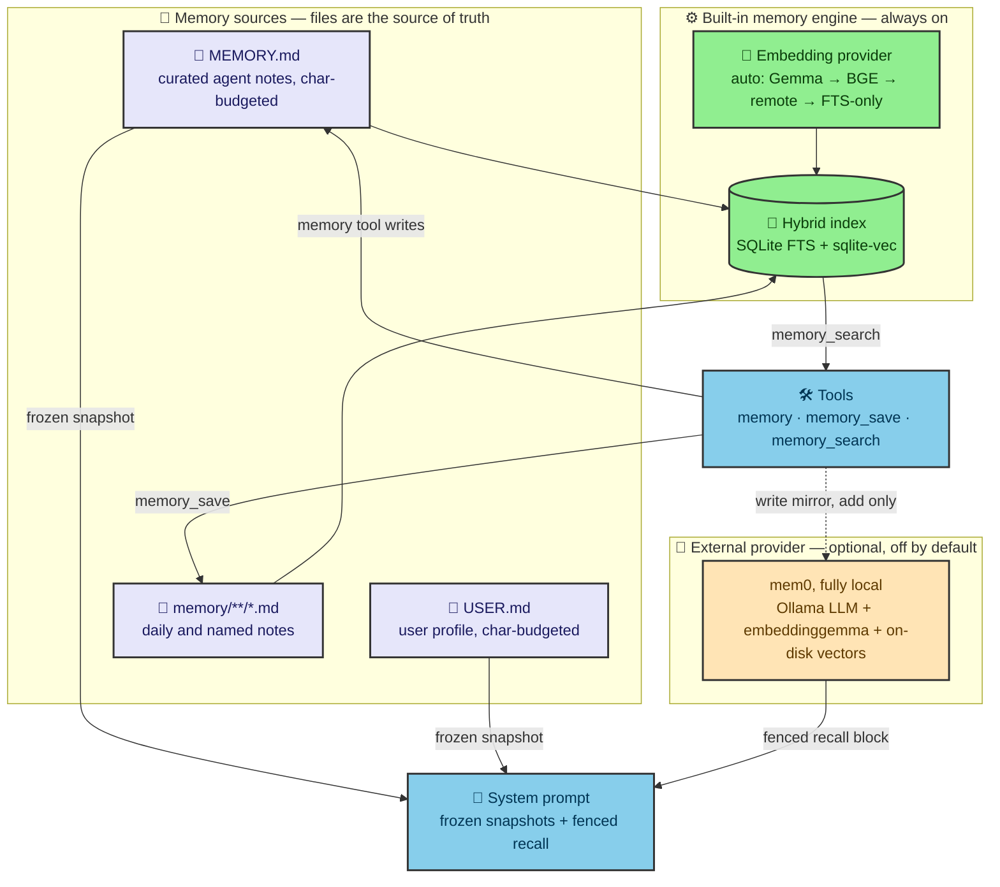
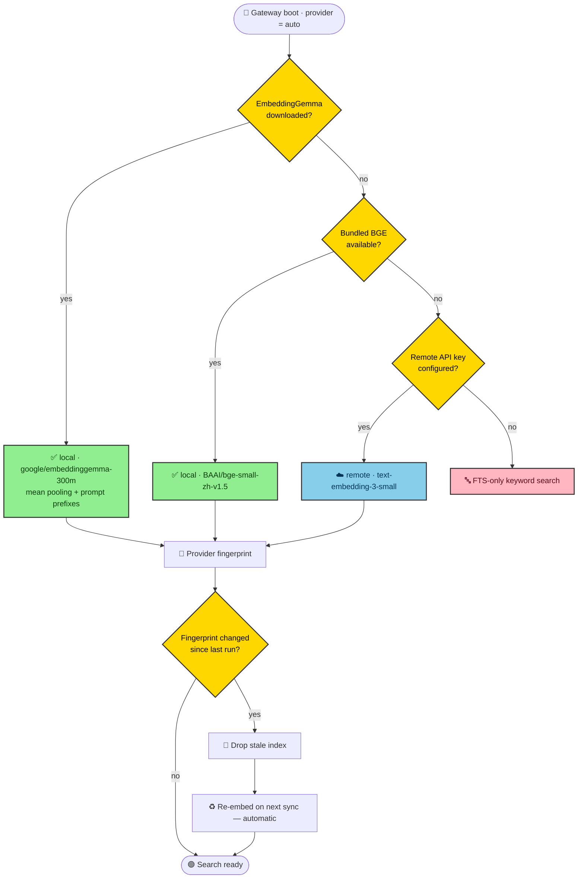
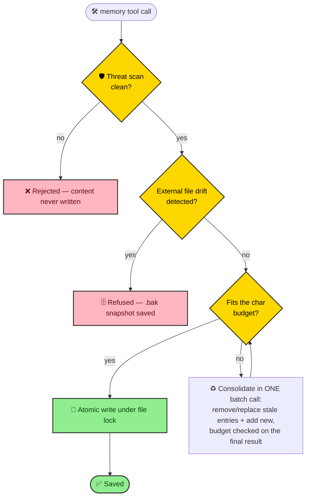
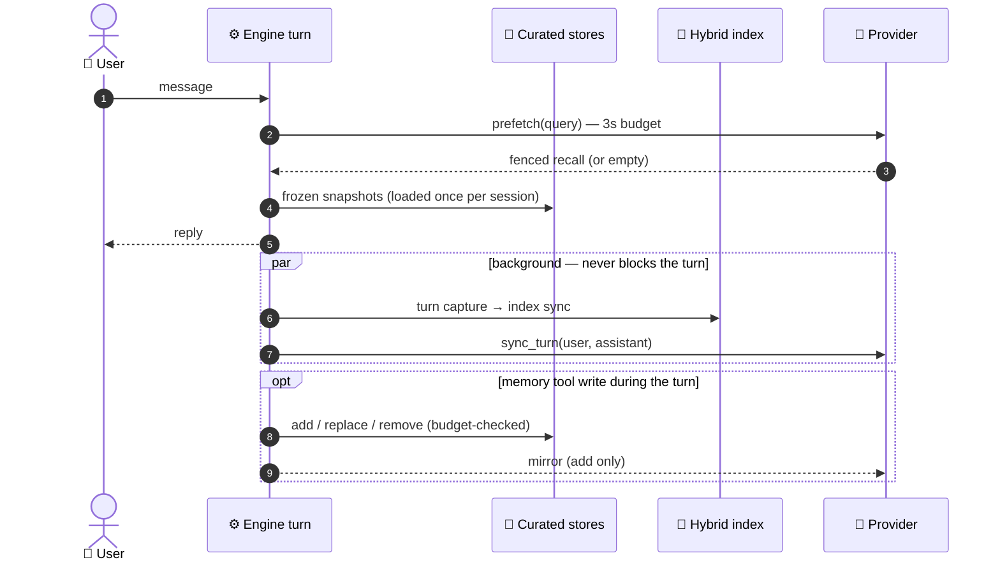

# Memory

AgentOS memory helps the agent recall durable context without replaying
every old conversation. Use it for stable preferences, reusable project facts,
previous decisions, and notes that should survive across sessions.

Memory is separate from skills. Skills teach the agent how to do a task; memory
stores useful facts and context the agent may need later.

## How it fits together



## What to Store

Good memory entries are stable and reusable:

- user preferences;
- project conventions;
- recurring output formats;
- names of important repositories, directories, or services;
- decisions the user wants reused;
- brief notes from completed tasks.

Avoid memory for:

- API keys or secrets;
- raw private data that does not need long-term recall;
- one-off instructions for the current turn;
- noisy dumps that would pollute future retrieval;
- exact transcripts that should instead be exported as session records.

## Common Commands

Inspect memory health:

```sh
agentos memory status
agentos memory status --deep
```

Index and list memory sources:

```sh
agentos memory index
agentos memory list
```

Search and inspect memory:

```sh
agentos memory search "release note format"
agentos memory show <path>
```

Search previous sessions as well as memory:

```sh
agentos memory search "deployment decision" --source all
```

## Natural Chat Usage

Ask naturally when something should be remembered:

```text
Remember that I prefer concise release notes with a risk section.
```

Later, refer to the preference:

```text
Use my usual release-note format for this changelog.
```

When memory seems stale, ask the agent to search explicitly:

```text
Search memory for my release-note preferences before drafting this.
```

## Session-Derived Memory

For long or important sessions, flush session state into memory before
archiving, compacting, or switching tasks:

```sh
agentos memory flush-session <session-key>
```

Use session export when exact old wording matters:

```sh
agentos sessions export <session-key>
```

Memory is for useful recall. Session export is for exact records.

## Embeddings and semantic search

Hybrid retrieval (the default) blends keyword (FTS) search with vector search.
Vectors come from an embedding provider selected by `[memory.embedding]`. In the
default `provider = "auto"` mode AgentOS picks the first available option in this
order:

1. A downloaded **EmbeddingGemma** model (higher quality, 768-dim).
2. The **bundled BGE-small** ONNX export (offline, ships with the recommended
   install).
3. A memory-specific **remote** embedding key, if one is configured.
4. **FTS-only** (keyword search) when nothing else is available.



### Upgrading the local model

The bundled BGE model works offline with no setup. To upgrade to EmbeddingGemma,
download its ONNX export once:

```sh
agentos memory embedding-download
```

The files land under `~/.agentos/models/embeddings/`. Use `--model <id>` to select
a different model; the default is `google/embeddinggemma-300m`. Auto mode then
prefers the downloaded model automatically — no config change required, but the
gateway must be restarted to pick it up (see below). To pin a specific
local model instead of relying on auto, set `[memory.embedding.local]`:

```toml
[memory.embedding.local]
model = "google/embeddinggemma-300m"  # or "BAAI/bge-small-zh-v1.5"
```

### Reindex on model switch

The active provider, model id, and ONNX directory are hashed into an embedding
**fingerprint**. Switching the local model (for example, after downloading
EmbeddingGemma or changing `[memory.embedding.local].model`) changes that
fingerprint, so existing vectors are never mixed across incompatible models.

Applying a new local model requires restarting the gateway (or a full
stop/start) — the provider is resolved once at boot, so `agentos memory index
--force` against an already-running gateway just reindexes with whichever
provider it already loaded, not the new one. Once the gateway has restarted
with the new model, the fingerprint change is detected automatically and a
full reindex happens on the next sync; no manual `--force` step is needed.

## Curated memory (MEMORY.md / USER.md)

Two small, bounded files are injected into every system prompt so the agent
always has the highest-signal facts on hand without a retrieval round-trip:

- `MEMORY.md` — the agent's own notes (environment facts, conventions, tool
  quirks, lessons learned).
- `USER.md` — what the agent knows about the user (name, role, preferences,
  style).

Both stores live at the workspace root and are §-delimited lists of small
entries, not free-form prose. Each store is char-budgeted rather than
line- or entry-limited:

- `memory.curated_memory_char_limit` (default `4000`) bounds `MEMORY.md`.
- `memory.curated_user_char_limit` (default `2000`) bounds `USER.md`.
- `memory.inject_limit` (default `6400`) bounds the combined text actually
  injected into the system prompt. It is kept comfortably above the sum of
  the two budgets plus header overhead so a full `MEMORY.md` and a full
  `USER.md` both fit without either block being dropped. If a block would
  push the joined result over `inject_limit`, that block (and any
  lower-priority block after it) is dropped whole rather than sliced
  mid-block — memory is checked first, then user.

All three limits can also be adjusted from the gateway web UI: **Agent setup →
Guided → Capabilities → Memory settings**. The card exposes friendly labels for
each budget and warns when the combined limits would exceed the injection
limit. Changes save through `config.patch` and apply immediately — no gateway
restart needed.

### The `memory` tool

Writes go through a single `memory` tool, not free-form file edits:

```json
{"action": "add", "target": "memory", "content": "Deploys with make deploy"}
{"action": "replace", "target": "user", "old_text": "prefers dark mode", "content": "Prefers dark mode and 2-space indent"}
{"action": "remove", "target": "memory", "old_text": "stale fact"}
```

`target` is `"memory"` (default) or `"user"`. Multiple changes in one turn
should use the batch shape instead, which applies atomically against the
*final* budget:

```json
{
  "target": "memory",
  "operations": [
    {"action": "remove", "old_text": "old deploy note"},
    {"action": "add", "content": "Deploys with make deploy"}
  ]
}
```

### Consolidation when full

An `add` (or a batch whose final result) that would exceed the store's char
limit is rejected with the current entries returned in the response, so the
agent can consolidate: `replace` overlapping entries or `remove` stale ones,
then retry — ideally in the same batch call so a single round-trip both
frees room and adds the new fact. Repeated consolidation failures within a
turn cap out after a few attempts so a fragile add/replace can't loop the
turn to budget exhaustion.



### Drift guard (`.bak` files)

Each store expects its file to be a clean §-delimited list it wrote itself.
If an external writer (a patch tool, shell append, manual edit, or a
concurrent session) leaves content on disk that would not round-trip through
that format, the next `replace`/`remove`/batch call is refused rather than
silently discarding the foreign content. A timestamped snapshot is written
next to the file (e.g. `MEMORY.md.bak.<unix_ts>`) and the tool response
points at it so the drift can be reviewed and reconciled before retrying.

### Migration note

Agents that had a free-form `MEMORY.md` (headings, bullet lists, paragraphs)
from before curated memory existed are migrated automatically, once, the
first time the curated store loads: the text is split into entries and kept
up to 80% of the char budget, with any remainder archived to
`memory/archive/memory-overflow.md` (still indexed and searchable — nothing
is lost). `MEMORY.md` is rewritten in place as a clean §-delimited list.

### `memory_save` scope

`memory_save` now targets only `memory/**/*.md` notes — it no longer accepts
`MEMORY.md` directly. Durable facts about the agent or the user go through
the `memory` tool described above instead.

## External memory providers

Built-in memory (the index, curated files, and dream consolidation above) is
always on. On top of it you can enable an **external memory provider** — an
extra recall/write layer that runs alongside built-in memory rather than
replacing it. It is **disabled by default**: with no provider selected the
layer is never imported and adds zero overhead.

When a provider is active it hooks four points:

- **Prompt block** — a recall block is assembled into the system prompt each
  turn, so relevant prior facts are available to the model up front.
- **Fenced recall** — recalled provider memories are wrapped in a clear fence
  in the prompt so they are attributable and cannot be confused with the live
  conversation.
- **Per-turn sync** — after each turn the user/assistant exchange is handed to
  the provider (serialized through one background queue per manager) so it can
  extract and store durable memories.
- **Write mirror** — curated `memory` tool **ADDs** are mirrored to the
  provider so it picks up new facts too; replace/remove are not propagated
  in v1, so the provider's copy can drift from edited or deleted notes.



### mem0 (fully local by default)

The bundled provider is [mem0](https://github.com/mem0ai/mem0). Its defaults
target a **fully local stack** so it works offline with no API keys and no data
leaving the machine:

- **LLM**: Ollama running `qwen3:4b` at `http://localhost:11434` (used to
  extract and summarize memories).
- **Embedder**: Ollama running `embeddinggemma` at the same endpoint.
- **Vector store**: an on-disk store under the agent state directory
  (`<agent state dir>/mem0`) when `vector_store_path` is left empty.

Install the optional extra (it is **not** a required dependency — `mem0ai` is
never imported unless the provider is selected):

```sh
pip install 'use-agent-os[mem0]'
```

Make sure Ollama is running and the two models are pulled:

```sh
ollama pull qwen3:4b
ollama pull embeddinggemma
```

### Configuration

Select and tune the provider under `[memory.provider]`:

```toml
[memory.provider]
name = "mem0"  # "" (disabled, default) | "mem0"

[memory.provider.mem0]
llm_provider = "ollama"
llm_model = "qwen3:4b"
llm_base_url = "http://localhost:11434"
embedder_provider = "ollama"
embedder_model = "embeddinggemma"
embedder_base_url = "http://localhost:11434"
vector_store_path = ""  # empty -> <agent state dir>/mem0
```

The same keys are editable from **Agent setup**: Guided mode's **Memory
settings** card (the *Memory provider* selector) and Advanced mode's **Memory**
section.

**Restart required.** The provider manager is built once at gateway boot, so
changing `memory.provider.name` — or any `memory.provider.mem0.*` setting —
only takes effect after a gateway restart. Both Agent setup modes surface a
restart hint when you save these keys.

**Privacy.** With the default stack, everything (LLM, embeddings, vector
store) stays on the local machine. mem0 telemetry is disabled, so no usage
data is sent externally.

## Maintenance and Repair

Refresh the index after editing memory files or changing memory configuration:

```sh
agentos memory index --force
```

Inspect fallback and repair surfaces:

```sh
agentos memory raw-fallbacks list
agentos memory repair list
```

Show or repair a degraded compaction memory record when instructed by
diagnostics:

```sh
agentos memory repair show --summary-id <id>
agentos memory repair run --summary-id <id>
```

## Best Practices

- Keep entries short and sourceable.
- Prefer "Remember X for project Y" over vague "remember this."
- Search memory before assuming the agent forgot.
- Remove or revise stale preferences instead of adding contradictory ones.
- Keep secrets out of memory.
- Use artifacts or files for large reference material.

---

[Docs index](../README.md) · [Product guide](../../README.product.md) · [Improve this page](../contributing-docs.md) · [Report a docs issue](https://github.com/use-agent-os/agent-os/issues/new?template=docs_report.yml)
